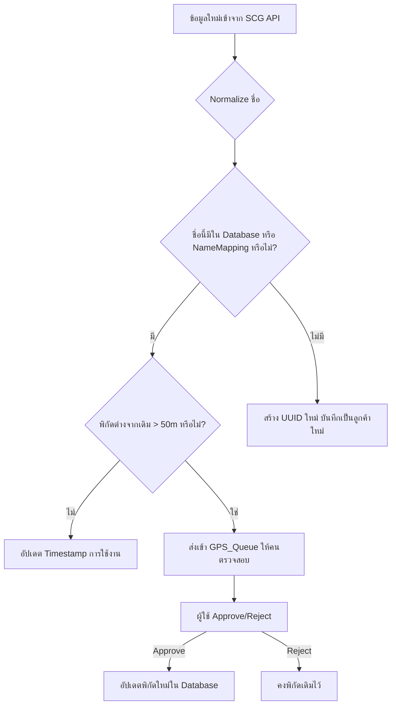

# การวิเคราะห์โปรเจค scg_ppy และแนวทางการพัฒนา

เอกสารฉบับนี้สรุปผลการวิเคราะห์โปรเจค `scg_ppy` บน GitHub Repository ของคุณ `Siriwat08` โดยมีวัตถุประสงค์เพื่อประเมินความเสี่ยงของโมดูลต่างๆ, ชี้จุดที่ไม่จำเป็น, แนะนำการปรับปรุงฐานข้อมูล และเสนอแนวทางการแก้ไขปัญหาข้อมูลซ้ำซ้อนตามที่คุณได้สอบถาม

## 1. ภาพรวมสถาปัตยกรรมและโมดูล

โปรเจคนี้เป็นระบบจัดการข้อมูลโลจิสติกส์หลัก (Logistics Master Data) ที่ทำงานบน Google Apps Script โดยใช้ Google Sheets เป็นฐานข้อมูลหลัก มีสถาปัตยกรรมที่แบ่งเป็นโมดูลต่างๆ ชัดเจน ดังนี้

| โมดูล (ไฟล์ .gs) | หน้าที่หลัก | การประเมินเบื้องต้น |
| :--- | :--- | :--- |
| `Config.gs` | กำหนดค่าคงที่, Schema, และ API Keys | เป็นศูนย์กลางการตั้งค่าที่ดี แต่การเปลี่ยนแปลงต้องแก้ไขโค้ดโดยตรง |
| `Service_SCG.gs` | ดึงข้อมูลจาก SCG JWD API และประมวลผลลงชีต `Data` | มีความเสี่ยงสูงจากการเปลี่ยนแปลงของ External API |
| `Service_Master.gs` | ซิงค์ข้อมูลใหม่จาก `SCGนครหลวงJWDภูมิภาค` ไปยังชีต `Database` | ตรรกะซับซ้อน แต่ออกแบบมาเพื่อจัดการข้อมูลใหม่และข้อมูลเดิม |
| `Service_SoftDelete.gs` | จัดการสถานะข้อมูล (Active, Inactive, Merged) และรวมข้อมูลซ้ำซ้อน | เป็นหัวใจของการทำ Data Deduplication มีฟังก์ชัน `resolveUUID` ที่ดี |
| `Service_Agent.gs` | ใช้ Gemini AI ในการจับคู่ชื่อที่ไม่รู้จัก (Unknown Names) | เป็นส่วนที่ทันสมัยและมีประสิทธิภาพ แต่ต้องดูแลเรื่อง Prompt และ API Key |
| `Service_GeoAddr.gs` | ประมวลผลที่อยู่และพิกัดภูมิศาสตร์ผ่าน Google Maps API | มีการทำ Caching เพื่อเพิ่มประสิทธิภาพและลดค่าใช้จ่าย |
| `Service_SchemaValidator.gs` | ตรวจสอบความถูกต้องของโครงสร้างชีต (Headers, Columns) | เป็นเครื่องมือสำคัญที่ช่วยป้องกัน Error ก่อนการประมวลผล |
| `Utils_Common.gs` | ฟังก์ชันช่วยเหลือส่วนกลาง เช่น การทำ Normalization, UUID, และ Haversine | รวมฟังก์ชันที่ใช้บ่อยไว้ที่เดียว ทำให้โค้ดสะอาดและนำกลับมาใช้ใหม่ได้ง่าย |
| `Setup_Upgrade.gs` | เครื่องมือสำหรับอัปเกรดโครงสร้างและตรวจสอบคุณภาพข้อมูล | มีฟังก์ชัน `findHiddenDuplicates` ที่มีประโยชน์มากในการหาข้อมูลที่น่าจะซ้ำกัน |

## 2. การวิเคราะห์ความเสี่ยงและส่วนที่ไม่จำเป็น

จากการตรวจสอบโค้ดทั้งหมด ผมได้ระบุจุดที่มีความเสี่ยงและข้อเสนอแนะในการปรับปรุงดังนี้

### จุดที่มีความเสี่ยงสูง (High-Risk Areas)

1.  **การพึ่งพา External API (`Service_SCG.gs`):**
    *   **ความเสี่ยง:** การดึงข้อมูลใช้ `cookie` ในการยืนยันตัวตน ซึ่งอาจหมดอายุได้ และโครงสร้าง JSON ที่ตอบกลับจาก `fsm.scgjwd.com` หากมีการเปลี่ยนแปลงจะทำให้ฟังก์ชัน `fetchDataFromSCGJWD` **Error ทันที** เพราะการแตกข้อมูล (Flattening) ถูก Hardcode ไว้
    *   **ข้อเสนอแนะ:** ควรเพิ่มการตรวจสอบโครงสร้าง JSON ที่ได้รับมาก่อนประมวลผล และมีระบบแจ้งเตือนเมื่อโครงสร้างไม่ตรงตามที่คาดหวัง อาจใช้ `try-catch` ร่วมกับการ Logging ที่ละเอียดขึ้น

2.  **การจัดการ API Key (`Config.gs`, `Service_Agent.gs`):**
    *   **ความเสี่ยง:** `GEMINI_API_KEY` ถูกเก็บใน `PropertiesService` ซึ่งเป็นวิธีที่ถูกต้อง แต่หาก Key ไม่ได้ถูกตั้งค่าไว้ ระบบจะหยุดทำงานทันที (Throw Critical Error) ซึ่งอาจกระทบกับ User Experience
    *   **ข้อเสนอแนะ:** ในฟังก์ชัน `validateSystemIntegrity` ควรมีการตรวจสอบ `GEMINI_API_KEY` ที่เป็นมิตรกับผู้ใช้มากขึ้น เช่น การแนะนำให้เรียกใช้ฟังก์ชัน `setupEnvironment()` ผ่านเมนู แทนการแสดง Error ที่เป็น Technical เกินไป

3.  **ความถูกต้องของ Schema (`Service_SchemaValidator.gs`):**
    *   **ความเสี่ยง:** แม้ว่าจะมีระบบตรวจสอบ Schema ที่ดี แต่หากผู้ใช้แก้ไขชื่อ Header หรือลบคอลัมน์โดยไม่ตั้งใจ ฟังก์ชันหลักๆ ของระบบจะหยุดทำงานทันที
    *   **ข้อเสนอแนะ:** สร้างเมนู "ซ่อมแซม Schema" ที่สามารถกดเพื่อสร้าง Header ที่ถูกต้องขึ้นมาใหม่ได้อัตโนมัติ (คล้ายๆ `fixNameMappingHeaders` แต่ทำให้ครอบคลุมทุกชีต) และป้องกันการแก้ไข Header โดยตรงผ่าน `SpreadsheetApp.Protection`

### ส่วนที่ไม่จำเป็นหรือสามารถปรับปรุงได้

1.  **ฟังก์ชันที่ไม่ได้ใช้งาน (`Utils_Common.gs`):**
    *   **ส่วนที่ไม่จำเป็น:** ในไฟล์มีฟังก์ชัน `checkUnusedFunctions` และ `verifyFunctionsRemoved` ที่อ้างอิงถึง `calculateSimilarity`, `editDistance`, `cleanPhoneNumber`, `parseThaiDate`, และ `chunkArray` ซึ่งดูเหมือนจะเป็นโค้ดเก่าที่เตรียมไว้สำหรับลบทิ้ง แต่ยังไม่ได้ลบออกจริงๆ
    *   **ข้อเสนอแนะ:** **ลบฟังก์ชันเหล่านี้ออกได้เลย** เพื่อให้ Codebase สะอาดขึ้น

2.  **การ Hardcode ค่าต่างๆ:**
    *   **จุดที่ควรปรับปรุง:** มีการ Hardcode ค่า Threshold และ Logic บางอย่าง เช่น ระยะทาง `50` เมตรใน `Service_Master.gs` และ `Setup_Upgrade.gs` หรือ Prompt ของ Gemini AI ใน `Service_Agent.gs`
    *   **ข้อเสนอแนะ:** ย้ายค่าเหล่านี้ไปรวมไว้ที่ `CONFIG` ทั้งหมด เพื่อให้ง่ายต่อการปรับจูนในอนาคต เช่น `CONFIG.DUPLICATE_DISTANCE_METERS = 50` หรือ `CONFIG.AI_PROMPT_TEXT = "..."`

## 3. การวิเคราะห์ชุดข้อมูลและข้อเสนอแนะสำหรับฐานข้อมูล

โปรเจคนี้ใช้ Google Sheets เป็นฐานข้อมูล ซึ่งเหมาะสมกับงานที่ไม่ซับซ้อนมากนัก แต่จากข้อมูลที่มีอยู่ สามารถนำมาพัฒนาต่อได้ดังนี้

### ชุดข้อมูลที่สามารถนำมาใช้ได้

*   **`Database` Sheet:** เป็น Master Data ที่มีคุณค่ามากที่สุด ประกอบด้วยชื่อ, ที่อยู่, พิกัดที่ผ่านการตรวจสอบแล้ว (Verified), และ UUID ซึ่งเป็นหัวใจของระบบ สามารถนำไปใช้เป็นฐานข้อมูลหลักสำหรับแอปพลิเคชันอื่นๆ ได้
*   **`NameMapping` Sheet:** เป็นชุดข้อมูล "ชื่อพ้อง" (Synonyms/Aliases) ที่เกิดจากการทำ Manual Mapping และ AI Mapping ซึ่งมีประโยชน์อย่างยิ่งในการเพิ่มความแม่นยำของการค้นหาและจับคู่ข้อมูล
*   **`PostalRef` Sheet:** เป็นข้อมูลอ้างอิงรหัสไปรษณีย์, อำเภอ, จังหวัด ที่มีประโยชน์ในการทำ Data Cleansing และ Standardization

### ข้อเสนอแนะเพิ่มเติม

1.  **เพิ่มมิติของข้อมูล (Data Dimension):** ปัจจุบัน `Database` เก็บข้อมูลลูกค้าเป็นหลัก แต่สามารถเพิ่มมิติอื่นๆ ได้ เช่น
    *   **ประเภทลูกค้า (Customer Type):** เช่น ร้านค้า, โกดัง, ไซต์งานก่อสร้าง
    *   **ขนาดของลูกค้า (Customer Size):** เช่น S, M, L โดยอาจอิงจากปริมาณการสั่งซื้อ
    *   **โซนพื้นที่ (Zone):** แบ่งพื้นที่ตามภูมิภาค หรือเขตการจัดส่ง เพื่อการวิเคราะห์เชิงพื้นที่

2.  **สร้าง Dashboard:** ใช้ Google Data Studio (Looker Studio) เชื่อมต่อกับ Google Sheets เหล่านี้เพื่อสร้าง Dashboard สำหรับผู้บริหาร สามารถแสดงข้อมูลสรุป เช่น จำนวนลูกค้าใหม่, สถานะข้อมูล (Active/Inactive/Merged), พื้นที่ที่มีข้อมูลซ้ำซ้อนเยอะ เป็นต้น

3.  **พิจารณาการย้ายไปฐานข้อมูลจริง:** หากข้อมูลมีปริมาณเกิน 1-2 แสนแถว หรือต้องการความเร็วในการค้นหาและประมวลผลที่สูงขึ้น ควรพิจารณาย้ายข้อมูลจาก Google Sheets ไปยังฐานข้อมูลจริง เช่น **Google Cloud SQL (MySQL/PostgreSQL)** หรือ **BigQuery** ซึ่งจะช่วยเพิ่มประสิทธิภาพและรองรับการขยายตัวในอนาคตได้ดีกว่า

## 4. แนวทางการแก้ไขปัญหาข้อมูลซ้ำซ้อน (8 ข้อ)

สำหรับปัญหาทั้ง 8 ข้อที่คุณสอบถามมา โปรเจคนี้มีเครื่องมือและแนวทางที่สามารถจัดการได้อยู่แล้ว แต่ผมจะสรุปและเพิ่มเติมแนวคิดให้ชัดเจนขึ้นในฐานะที่ "ถ้าโปรเจคนี้เป็นของผม"

> **หลักการสำคัญ:** สร้าง "Single Source of Truth" โดยใช้ **UUID (Universally Unique Identifier)** เป็น Key หลักเพียงหนึ่งเดียวสำหรับลูกค้าแต่ละราย และให้ข้อมูลอื่นๆ (ชื่อ, ที่อยู่, Lat/Long) เป็นเพียง Attribute ที่สามารถเปลี่ยนแปลงหรือมีได้หลายค่า

นี่คือแผนการจัดการในแต่ละกรณี:

| # | ปัญหา | แนวทางการจัดการของโปรเจคนี้ | ถ้าเป็นโปรเจคของผม (ข้อเสนอแนะเพิ่มเติม) |
|---|---|---|---|
| 1 | **ชื่อซ้ำ** | ใช้ `normalizeText()` เพื่อตัดคำที่ไม่สำคัญออกแล้วเปรียบเทียบ ถ้าเหมือนกันจะถือว่าเป็นข้อมูลเดียวกัน | **ถูกต้องแล้ว** ควรปรับปรุง `normalizeText()` ให้ฉลาดขึ้นเรื่อยๆ โดยเพิ่มรายการ Stop Words จากข้อมูลจริง |
| 2 | **ที่อยู่ซ้ำ** | โปรเจคนี้เน้นที่ชื่อและพิกัดเป็นหลัก ยังไม่มีการเปรียบเทียบที่อยู่โดยตรง | เพิ่มฟังก์ชัน `normalizeAddress()` เพื่อเปรียบเทียบที่อยู่โดยเฉพาะ โดยตัดเลขที่, หมู่, ซอย, ถนน ออก แล้วเปรียบเทียบแค่ ตำบล, อำเภอ, จังหวัด, รหัสไปรษณีย์ |
| 3 | **Lat/Long ซ้ำ** | ใช้ฟังก์ชัน `findHiddenDuplicates()` ใน `Setup_Upgrade.gs` เพื่อหาพิกัดที่อยู่ในระยะใกล้เคียงกัน (≤ 50 เมตร) | **ยอดเยี่ยมมาก** ควรตั้งเวลาให้ฟังก์ชันนี้ทำงานอัตโนมัติทุกสัปดาห์ (Scheduled Trigger) และส่งรายงานผลมาทางอีเมลหรือ LINE Notify |
| 4 | **ชื่อเขียนไม่เหมือนกัน** | ใช้ `NameMapping` Sheet ร่วมกับ `Service_Agent.gs` (Gemini AI) เพื่อจับคู่ชื่อที่คล้ายกันแต่เขียนต่างกัน (เช่น "เซ็นทรัล" vs "Central") ไปยัง Master UUID เดียวกัน | **เป็นวิธีที่ดีที่สุด** ควรมีหน้า UI ให้ผู้ใช้สามารถ "Review" การจับคู่ของ AI ได้ เพื่อเพิ่มความแม่นยำและสอน AI ไปในตัว |
| 5 | **คนละชื่อแต่ที่อยู่เดียวกัน** | โปรเจคนี้ยังไม่ได้จัดการโดยตรง | เพิ่ม Logic ตรวจสอบ: หากพบว่ามี 2 UUID ที่มี "Normalized Address" เหมือนกัน ให้สร้าง Flag "Review_SameAddress" เพื่อให้คนตรวจสอบ อาจเป็นบริษัทในเครือ หรือข้อมูลผิด |
| 6 | **ชื่อเดียวกันแต่ที่อยู่ไม่เหมือนกัน** | ถือว่าเป็นคนละสาขา (Branch) และสร้างเป็น 2 UUID ที่แยกจากกัน | **ถูกต้องแล้ว** นี่คือการจัดการสาขาที่ถูกต้อง ควรปรับปรุงการแสดงผลให้เห็นชัดเจนว่าเป็นคนละสาขากัน เช่น "SCG (บางซื่อ)" และ "SCG (รังสิต)" |
| 7 | **ชื่อเดียวกัน แต่ Lat/Long คนละที่** | `Service_Master.gs` จะตรวจจับว่าพิกัดต่างกันเกิน 50 เมตร และส่งข้อมูลเข้า `GPS_Queue` Sheet เพื่อให้มนุษย์ตรวจสอบและยืนยัน (Approve/Reject) | **เป็นกระบวนการที่ถูกต้องและปลอดภัย** ควรพัฒนาระบบแจ้งเตือนเมื่อมีรายการใหม่ใน `GPS_Queue` เพื่อให้ทีมงานเข้าไปจัดการได้ทันที |
| 8 | **คนละชื่อ แต่ Lat/Long เดียวกัน** | `findHiddenDuplicates()` จะตรวจเจอกรณีนี้ และแจ้งเตือนว่าเป็น "Hidden Duplicates" | **ถูกต้อง** หลังจากได้รับการแจ้งเตือน ควรใช้ฟังก์ชัน `mergeDuplicates_UI()` ใน `Service_SoftDelete.gs` เพื่อรวม UUID ที่ซ้ำซ้อนให้เหลือเพียงอันเดียวที่ถูกต้อง |

### Flowchart ตัวอย่าง: การจัดการข้อมูลใหม่

## 5. สรุปและขั้นตอนถัดไป

โปรเจค `scg_ppy` มีโครงสร้างและสถาปัตยกรรมที่ดี มีการแบ่งโมดูลชัดเจนและนำหลักการจัดการข้อมูลสมัยใหม่มาใช้ เช่น การใช้ UUID, การทำ Soft Delete, และการใช้ AI ช่วยเหลือ ซึ่งแสดงให้เห็นถึงความเข้าใจในปัญหาอย่างลึกซึ้ง

**ข้อเสนอแนะในภาพรวม:**

1.  **Refactor & Cleanup:** ลบฟังก์ชันที่ไม่ได้ใช้งาน และย้ายค่า Hardcode ไปที่ `Config.gs`
2.  **Enhance Robustness:** เพิ่มการป้องกัน Error จาก External API และการแก้ไข Schema โดยผู้ใช้
3.  **Automate & Monitor:** ตั้งเวลาให้ฟังก์ชันตรวจสอบคุณภาพข้อมูลทำงานอัตโนมัติ และสร้าง Dashboard เพื่อติดตามสถานะของข้อมูล
4.  **Improve User Interface:** สร้างเมนูและ UI ที่ช่วยให้ผู้ใช้สามารถจัดการข้อมูลได้ง่ายขึ้น เช่น การ Review AI, การซ่อมแซม Schema, และการ Merge ข้อมูล

ผมได้จัดทำรายงานนี้ขึ้นจากโค้ดทั้งหมดใน Repository หวังว่าจะเป็นประโยชน์ในการพัฒนาโปรเจคของคุณต่อไปครับ หากมีคำถามเพิ่มเติม สามารถสอบถามได้เลยครับ
